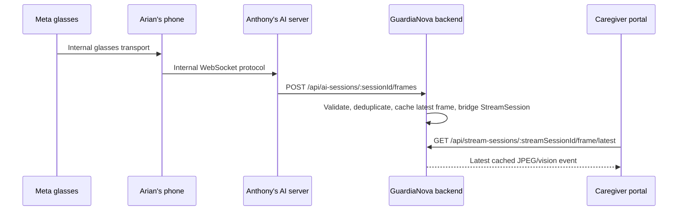

# Egocentric glasses frame architecture

## Control and frame paths

The caregiver browser never connects to Anthony's server. The end-to-end path is:



The AI-session APIs are the control plane. Processed frames are a bounded,
server-to-server frame data plane. There is no browser WebSocket, HLS, WebRTC,
public viewer URL, Anthony URL, or secondary browser token in this MVP.

## Anthony callback contract

`POST /api/ai-sessions/:sessionId/frames`

Authentication is `X-Api-Key: <AI_CALLBACK_API_KEY>`; `AI_AGENT_API_KEY` is
only for the outbound session-start request and is never accepted here. The
callback responds within Anthony's five-second timeout target with `202` once
validation, cache acceptance, and the lightweight StreamSession bridge finish.

```json
{
  "seq": 12,
  "ts": "2026-07-15T10:32:00.000000+00:00",
  "vision": {
    "description": "An older adult seated at a kitchen table.",
    "label": "kitchen",
    "flags": ["person_seated"],
    "advisory_flags": ["no_motion"]
  },
  "image": {
    "mime": "image/jpeg",
    "b64": "raw-base64-only"
  }
}
```

`image` is optional: image-only and vision-only events are valid, but a
callback cannot contain only `seq` and `ts`. The only accepted image type is
`image/jpeg`; `b64` is raw standard base64, never a data URL, SVG, or arbitrary
file MIME type. The schema accepts six-digit fractional ISO-8601 timestamps and
normalizes them to canonical UTC ISO strings.

`vision.flags` contains deterministic, open-vocabulary rule strings.
`vision.advisory_flags` contains open-vocabulary model observations. Advisory
flags are kept in lightweight backend metadata but are neither displayed in the
caregiver UI nor treated as authoritative alerts.

## Limits and callback processing

The frame route alone has a `1mb` JSON parser. The app-wide parser remains
`10kb`, preserving the existing escalation, conclude, authentication, and
ordinary API limits. The configured controls are:

```env
AI_FRAME_JSON_LIMIT=1mb
AI_FRAME_MAX_DECODED_BYTES=786432
AI_FRAME_CACHE_TTL_SECONDS=300
AI_FRAME_CACHE_MAX_SESSIONS=50
```

Raw base64 is checked strictly and its decoded byte size is calculated without
image processing. JPEGs over 768 KB decoded are rejected. The callback never
resizes, analyzes, writes, logs, or stores images in PostgreSQL. `413` is
returned for a route body that exceeds its parser limit.

## Ordering, latest-frame cache, and vision-only events

The backend retains one bounded in-memory entry per AI session. A larger `seq`
replaces the latest event; an equal `seq` is acknowledged as `duplicate`; a
lower `seq` is acknowledged as `out_of_order`. Both non-accepting cases return
`202` and never update StreamSession frame metadata.

The latest event's sequence and vision always advance. A newer vision-only
event preserves the most recently received JPEG and records whether a new image
was supplied. This avoids blanking the future viewer during text-only updates.
Cache entries expire after five minutes and oldest entries are evicted above 50
sessions. This implementation is appropriate for the current single PM2
process. Multiple backend instances need a shared cache such as Redis plus
object storage or another shared frame store.

## StreamSession bridge and caregiver access

On the first accepted frame, the server creates one active `glasses`
StreamSession with `metadata.aiSessionId`. Later accepted frames update that
same row; they do not create a row per frame. Only lightweight data is stored:
the AI session ID, latest sequence/timestamps, availability, description,
label, deterministic flags, and advisory flags. Base64, raw image bytes, data
URLs, and whole callback bodies are never placed in AiSession or StreamSession
metadata or PostgreSQL. An older active glasses stream for the same patient and
a different AI session is marked ended with a supersession reason.

`GET /api/stream-sessions/:streamSessionId/frame/latest` requires the existing
caregiver JWT and verifies patient ownership, StreamSession status/`endedAt`,
`metadata.aiSessionId`, associated AiSession state, and matching cache patient
ID. It returns `200` with `available: false` while no cache entry exists or the
entry has expired, and also for ended, failed, unavailable, or otherwise
terminal streams. This database check is a second privacy boundary: an old
process-local cache record can never bypass terminal stream state. Its response
is protected with `Cache-Control: private, no-store, max-age=0` and `Pragma:
no-cache`.
Normal stream-status summaries expose only `aiSessionId`, frame availability,
sequence/time, label, and description; they do not include JPEG base64 or
advisory flags.

## Lifecycle and cache invalidation

`metadata.aiSessionId` is the authoritative bridge between an `AiSession` and
its glasses `StreamSession`; no Prisma relation or migration is required. A
centralized stream lifecycle helper locates all matching rows and closes only
current (`starting`/`active`) streams while preserving history and existing
lightweight metadata.

Anthony conclude, caregiver/mobile resolve, successful new-session
supersession, mobile stream stop, and supported terminal stream-status paths
end the associated stream and delete the current backend process's cache record
only after their database work succeeds. Repeated conclude/resolve/stop calls
remain safe: they do not duplicate transcripts or terminal events, but they can
reconcile an accidentally active associated stream. A late frame callback for a
terminal AI or stream returns `409`; it cannot refill the cache, create a new
stream row, or reopen historical state.

The stale AI-session cleanup script runs in a separate Node process. It now
closes associated database stream rows, but cannot delete the running PM2
process's in-memory map. That is safe because the latest-frame endpoint checks
database terminal state before exposing a cache entry. The stale map record
expires by TTL or disappears on backend restart; no IPC, Redis, or object store
is introduced for this MVP.

No background process terminates an active stream merely because frames stop.
The frontend marks the displayed image stale after eight seconds and keeps
polling. An explicit Anthony heartbeat or error/end callback is a future
recommendation, not an assumed endpoint.

## Deployment and runbooks

No Prisma migration is required. Before deployment, inspect the active NGINX
site configuration that proxies `https://caregiver.guardianova.com/api` (for
example the enabled site under `/etc/nginx/sites-enabled/` that has
`server_name caregiver.guardianova.com`; identify it safely with
`sudo nginx -T | grep -B 4 -A 12 caregiver.guardianova.com`). Add a *scoped*
location after checking the existing proxy location precedence:

```nginx
location ~ ^/api/ai-sessions/[^/]+/frames$ {
    client_max_body_size 1m;
    proxy_pass http://127.0.0.1:4000;
    proxy_http_version 1.1;
    proxy_set_header Host $host;
    proxy_set_header X-Real-IP $remote_addr;
    proxy_set_header X-Forwarded-For $proxy_add_x_forwarded_for;
    proxy_set_header X-Forwarded-Proto $scheme;
}
```

Validate with `sudo nginx -t`, then safely apply it with `sudo systemctl reload
nginx`. Do not increase the global NGINX limit unless a scoped location is
impractical after reviewing that configuration.

The complete NGINX, environment, Anthony handoff, and manual callback procedure
is in [EGOCENTRIC_STREAM_DEPLOYMENT.md](EGOCENTRIC_STREAM_DEPLOYMENT.md). The
real-device verification workflow is in
[EGOCENTRIC_STREAM_E2E_RUNBOOK.md](EGOCENTRIC_STREAM_E2E_RUNBOOK.md). Task 2
polls the authenticated latest-frame endpoint and renders the JPEG without
displaying vision or advisory metadata.
