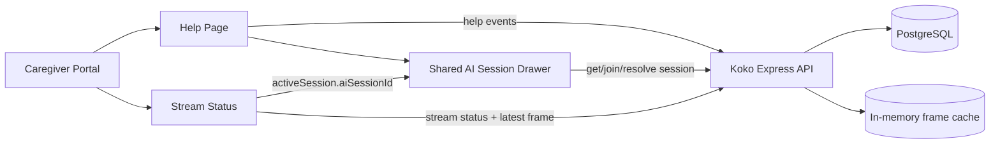
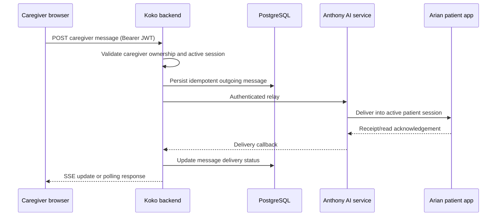

# MemAide / GuardiaNova — Help, Stream Status, and AI Support Session Implementation Roadmap

> **Roadmap date:** 2026-07-17  
> **Repository:** `C:\MemAide_github`  
> **Branch:** `koko/student2-work`  
> **Primary owner:** Koko / Student 2  
> **Status:** Approved planning document; implementation has not started from this roadmap  
> **Primary audit:** `docs/audits/HELP_AI_SESSION_PHASE1_DEEP_AUDIT_2026-07-17.md`  
> **Project handoff:** `MemAide_GuardiaNova_Current_Project_Handoff_2026-07-17(1).md`

---

## 1. Purpose

This document defines the product design, technical architecture, implementation order, safety constraints, test strategy, and acceptance criteria for improving:

1. The **Help** page.
2. **Recent Help Events**.
3. **AI Support Sessions**.
4. The relationship between **AI Support Sessions** and **Stream Status**.
5. Future caregiver-to-patient messaging and live transcript delivery.

It is intended to be the implementation source of truth for the next engineering phases.

This roadmap deliberately separates:

- improvements that are safe and possible inside the current repository;
- improvements that require Koko backend changes;
- improvements that require Anthony’s AI service;
- improvements that require Arian’s Android application;
- functionality that must not be presented in the UI until the complete delivery path exists.

---

## 2. Source-of-truth hierarchy

When sources disagree, use this order:

1. **Current source code and tests**
2. **Phase 1 deep audit**
3. **Current project handoff**
4. **This roadmap**
5. **Older design or planning documents**
6. **Original MVP proposal**

The roadmap is a plan, not proof that a feature exists.

No feature may be described as implemented, live, or real-time unless the current source code and test/runtime evidence prove it.

---

## 3. Confirmed current state

The Phase 1 audit established the following facts.

### 3.1 Recent Help Events

- The backend returns all matching help events for a patient.
- There is no backend `take`, cursor, page, or default result limit.
- The frontend renders every returned event.
- Date grouping already exists.
- The timeline already distinguishes Today, Yesterday, and older dates.
- The page length grows linearly with the lifetime number of help events.
- Patient-switch result guards exist, but Help-page requests are not aborted.

### 3.2 Join Session

The current Join action:

- validates caregiver ownership;
- changes `AiSession.status` to `caregiver_joined`;
- sets `caregiverJoinedAt`;
- adds a local event row stating that the caregiver joined;
- does not contact Anthony;
- does not publish to a WebSocket;
- does not notify Arian’s application;
- does not send a caregiver message to the patient;
- does not alter the glasses frame stream.

Therefore, Join currently means:

> Record that the caregiver is monitoring the support session.

It does **not** mean:

> Enter a real-time chat with the patient.

### 3.3 Messaging and transcript behavior

- There is no caregiver-message endpoint.
- There is no caregiver message composer.
- There is no browser-to-Anthony messaging path.
- There is no Koko-to-Anthony caregiver-message relay.
- There is no proven Arian-side caregiver-message receiver.
- Anthony’s real transcript is persisted in Koko’s database only when the conclude callback arrives.
- The current session detail modal fetches once and does not poll, subscribe, or connect to a WebSocket.
- A caregiver role can be rendered by the transcript UI, but no production code currently creates a caregiver message.

### 3.4 Stream Status linkage

The current stream-status response already exposes:

```text
activeSession.aiSessionId
```

That ID comes from:

```text
StreamSession.metadata.aiSessionId
```

Therefore, Stream Status can open the **exact AI session linked to the active glasses stream**.

The frontend must not guess by selecting the latest AI session for the patient.

### 3.5 Additional confirmed defect

The current caregiver resolution UI sends a summary, but the backend ignores it and persists a hardcoded summary.

This is silent data loss and must either be fixed or the input removed.

---

## 4. Product decisions

These decisions govern all implementation phases.

### 4.1 Keep Help and Stream Status as separate pages

Do not merge the full Help page into Stream Status.

**Help page responsibilities:**

- caregiver contact configuration;
- recent help-event history;
- current and historical AI support sessions;
- completed-session review.

**Stream Status responsibilities:**

- current smart-glasses stream state;
- latest patient-perspective frame;
- the AI support session linked to that exact stream;
- a fast Join/Open action for the active session.

### 4.2 Do not duplicate full AI-session history on Stream Status

Stream Status should expose the one session linked to the displayed stream.

The full session list and history remain on Help.

### 4.3 Keep status and action separate

The right side of the viewer header must contain both:

- a stream/session status indicator;
- an optional action button.

Do not replace `Live`, `Waiting`, `Stale`, `Ended`, or `Unavailable` with a Join button.

Status answers:

> What is happening?

Action answers:

> What can the caregiver do?

### 4.4 Do not create a fake message composer

A message input must not appear until all of the following exist and are verified:

1. caregiver message endpoint in Koko’s backend;
2. authenticated relay from Koko to Anthony;
3. Anthony routing to the active patient conversation;
4. Arian’s app displaying the message;
5. delivery acknowledgement or clear failure state;
6. end-to-end tests and a live-device verification.

A text box that only writes to Koko’s database is not acceptable.

### 4.5 Do not call polling “real-time”

The frame viewer currently polls.

The planned Phase 2 session panel may poll session details.

Use wording such as:

- `Updates automatically`
- `Refreshing session activity`
- `Last updated ...`

Do not use:

- `Real-time chat`
- `Live messaging`
- `Instant delivery`

until Phase 4 acceptance criteria pass.

### 4.6 Preserve authentication boundaries

| Direction | Authentication |
|---|---|
| Caregiver browser → Koko | Caregiver Bearer JWT |
| Arian mobile app → Koko | Caregiver Bearer JWT plus device/patient ownership |
| Koko → Anthony | `X-Api-Key: AI_AGENT_API_KEY` |
| Anthony → Koko callbacks | `X-Api-Key: AI_CALLBACK_API_KEY` |

No browser or mobile client may receive backend secrets.

### 4.7 Do not connect the caregiver browser directly to Anthony

The caregiver browser should continue to communicate with Koko’s backend.

For future messaging:

```text
Caregiver browser
→ Koko backend
→ Anthony
→ Arian patient app
```

This keeps authorization, auditing, tenancy, rate limiting, and error handling under Koko’s control.

---

## 5. Target information architecture

### 5.1 Help page

Recommended order:

```text
Help
├── Help contact / WhatsApp configuration
├── Recent Help Events
│   ├── Today
│   ├── Yesterday
│   ├── Earlier
│   └── Show older events
└── AI Support Sessions
    ├── Current sessions
    └── Recent session history
```

The AI Support Sessions section must remain reachable without scrolling through the patient’s complete lifetime event history.

### 5.2 Stream Status page

Recommended order:

```text
Stream Status
├── Stream overview/status
├── Embedded Viewer
│   ├── Stream status badge
│   └── Join/Open/View Session action
├── Frame/state details
└── Optional session drawer when opened
```

### 5.3 Shared AI session experience

The Help page and Stream Status page should use the same session-detail implementation.

Do not maintain two independent modals with different behavior.

Recommended shared component:

```text
AiSessionPanel
```

or:

```text
AiSessionDrawer
```

It should support:

- opening by exact `sessionId`;
- read-only transcript/activity display;
- Join action when backend says `isJoinable`;
- Resolve action when allowed;
- manual and bounded automatic refresh;
- terminal summary;
- no message input during Phase 2.

---

## 6. Visual and interaction design

Use the existing GuardiaNova caregiver portal design language.

Primary visual references:

```text
C:\MemAide\Design-Frontend\code.html
C:\MemAide\Design-Frontend\DESIGN.md
```

Do not redesign unrelated pages.

### 6.1 Recent Help Events card

#### Header

```text
Recent Help Events                         [Date filter]
Latest help requests and session activity
```

Optional count:

```text
8 shown · 24 total
```

Do not make the count visually dominant.

#### Initial display

Show a maximum of **8 event rows** by default.

The 8-row value should be a named constant, not scattered magic numbers:

```ts
const INITIAL_VISIBLE_HELP_EVENTS = 8;
```

Retain chronological ordering:

```text
newest → oldest
```

Retain date groups:

- Today
- Yesterday
- Earlier date labels

If an event group crosses the visible limit, render the visible rows under the correct group. Do not show an empty date header.

#### Expand behavior

When more events exist:

```text
Show 8 older events                          ChevronDown
```

Each click should reveal the next 8.

When all fetched events are visible:

```text
Hide older events                            ChevronUp
```

Collapsing returns to the initial 8.

An arrow by itself is not acceptable.

The control must include:

- visible text;
- `aria-expanded`;
- `aria-controls`;
- keyboard focus;
- disabled/loading behavior if later connected to backend pagination.

#### Row design

Use compact rows rather than large independent cards.

Each row should include:

- status icon or dot;
- event type/status;
- source device;
- local date/time;
- optional AI-session badge;
- optional concise supporting text.

Avoid repeating full patient/contact information on every row.

Long text should wrap safely, but the default row should remain compact.

#### Empty state

```text
No help events for this period.
```

#### Error state

Retain inline error and Retry.

Do not replace the entire page with an error screen.

### 6.2 AI Support Sessions section on Help

Keep:

- current sessions first;
- recent history second;
- backend-authoritative status badges;
- manual Refresh.

Improve:

- current session cards should be more prominent than completed history;
- historical rows should be compact;
- action labels must match actual capabilities;
- no copy may imply caregiver-to-patient chat.

Recommended helper copy:

```text
Review AI support activity and mark when a caregiver is monitoring a session.
```

For current Phase 2 behavior, Join can remain the action label, but the session panel must disclose:

```text
Joining records that you are monitoring this session.
Direct messaging is not available in this version.
```

### 6.3 Embedded Viewer header

Current concept:

```text
[Icon]  EMBEDDED VIEWER
        Smart glasses frame             [Ended]
```

Target active state:

```text
[Icon]  EMBEDDED VIEWER
        Smart glasses frame             [Live] [Join session]
```

Target already-joined state:

```text
[Icon]  EMBEDDED VIEWER
        Smart glasses frame             [Live] [Open session]
```

Target ended state:

```text
[Icon]  EMBEDDED VIEWER
        Smart glasses frame             [Ended] [View summary]
```

`View summary` is only shown when a linked ended AI session ID is reliably available.

#### Header rules

- Keep the status badge.
- Add the action beside the status.
- On smaller widths, allow the right controls to wrap below the title.
- Never overlap the viewer.
- Keep one clear primary action.
- Use existing shared Button and Badge components.
- Use an icon only as supporting content, not as the only label.
- Loading label:

```text
Joining…
```

- Do not show a Join button when `aiSessionId` is missing.
- Do not fall back to the patient’s newest session.

### 6.4 Stream/session action matrix

| Stream state | AI session state | Status shown | Action |
|---|---|---|---|
| Active/fresh | Joinable | `Live` | `Join session` |
| Active/fresh | `caregiver_joined` | `Live` | `Open session` |
| Waiting for first frame | Joinable | `Waiting` | `Join session` |
| Waiting for first frame | Joined | `Waiting` | `Open session` |
| Stale | Non-terminal | `Stale` | `Open session` or `Join session` based on joinability |
| Reconnecting | Non-terminal | `Reconnecting` | `Open session`; disable mutation until state refresh if needed |
| Ended | Terminal + linked session available | `Ended` | `View summary` |
| Ended | No linked session | `Ended` | No session action |
| Failed/unavailable | Linked session available | `Unavailable` | `View session` |
| No stream | No session | `Unavailable` | No action |

The AI-session detail endpoint remains authoritative for Join eligibility.

Do not derive Join eligibility solely from stream state.

### 6.5 Shared AI session drawer

#### Desktop

Use a right-side drawer or two-column layout.

Recommended width:

```text
min(440px, 40vw)
```

The frame remains visible behind or beside the panel.

The drawer scrolls independently.

#### Mobile

Use a full-height bottom sheet or full-screen dialog.

Do not squeeze the frame and transcript side by side.

#### Drawer content

```text
AI Support Session
[Status badge] [Refresh]

Patient / session facts
Started
Last activity
Caregiver joined
Emergency/escalation indicator

Information notice
"Joining records that you are monitoring this session.
Direct messaging is not available in this version."

Session activity / transcript
...

Footer actions
[Close] [Join session] or [Resolve session]
```

#### Refresh behavior

During Phase 2:

- fetch immediately on open;
- refresh every **5 seconds** only while:
  - panel is open;
  - browser tab is visible;
  - session is non-terminal;
- stop polling on terminal state;
- refresh on browser focus;
- provide a manual Refresh button;
- use `AbortController`;
- discard stale responses;
- show `Last updated`;
- do not call this real-time.

This polling can reveal status changes and the concluded transcript soon after the conclude callback. It does not create live transcript delivery during the active conversation.

#### Transcript/activity behavior

- Keep the scroll area independent.
- Preserve chronological order.
- Show role labels truthfully.
- Do not show a caregiver message bubble unless a caregiver message actually exists.
- No composer in Phase 2.
- On terminal session, show final summary and ended time.
- On an empty active session:

```text
No session activity has been recorded yet.
```

### 6.6 Resolution flow

The resolution textarea is retained only if Phase 2 backend work persists the entered summary.

Required behavior:

- trim whitespace;
- enforce a reasonable length;
- show validation inline;
- disable submit while resolving;
- persist exactly the entered summary;
- close or transition the panel only after success;
- show errors inline;
- never silently replace the caregiver’s text with a hardcoded value.

---

## 7. Technical architecture target

### 7.1 Phase 2 architecture



Phase 2 does not add a browser WebSocket and does not add caregiver messaging.

### 7.2 Future messaging architecture



No UI composer may be enabled until this path is implemented and verified.

---

## 8. Phase 2 — Immediate repository implementation

Phase 2 is the next approved implementation phase.

It is divided into small, reviewable subphases.

---

### Phase 2A — Bound Recent Help Events

#### Objective

Prevent lifetime help-event history from pushing AI Support Sessions far down the page.

#### Required changes

1. Add an initial visible event limit of 8.
2. Preserve current Today/Yesterday/date grouping.
3. Add incremental `Show 8 older events`.
4. Add `Hide older events`.
5. Reset visible count when:
   - selected patient changes;
   - date filter changes;
   - event query changes.
6. Preserve loading/error/empty states.
7. Keep current request-id stale-response protection.
8. Add `AbortController` if the current API client supports passing a signal cleanly.
9. Add frontend tests.

#### Likely files

```text
client/src/features/help/HelpPage.tsx
client/src/features/help/components/HelpEventsSection.tsx
client/src/features/help/components/HelpEventTimeline.tsx
client/src/features/help/components/HelpEventCard.tsx
client/src/services/apiClient.ts
client/src/features/help/**/*.test.tsx
```

#### Required tests

- 0 events.
- 1–8 events.
- More than 8 events.
- Correct first 8 newest events.
- Show next 8.
- Hide older.
- No empty day headings.
- Today/Yesterday grouping preserved.
- Patient change resets to 8.
- Date filter change resets to 8.
- Keyboard activation.
- `aria-expanded` changes correctly.
- Error and Retry still work.

#### Phase 2A definition of done

- AI Support Sessions is reachable without scrolling through all history.
- Default DOM event-row count is at most 8.
- Existing event ordering and date labels remain correct.
- No backend API behavior is changed.
- No unrelated page is modified.

---

### Phase 2B — Shared session panel and Stream Status action

#### Objective

Let the caregiver view the exact AI session connected to the displayed glasses stream without leaving the frame context.

#### Required changes

1. Extract or refactor the existing AI session detail modal into a reusable shared component.
2. Use the same component from:
   - Help AI Support Sessions;
   - Stream Status viewer.
3. Read the exact ID from:

```text
summary.activeSession.aiSessionId
```

4. Add viewer-header actions:
   - `Join session`
   - `Open session`
   - optional `View summary`
5. Keep the existing stream status visible.
6. On `Join session`:
   - disable while request is pending;
   - call existing Join endpoint;
   - refetch detail;
   - open/retain the panel;
   - handle 409 by refreshing authoritative state rather than presenting a raw error.
7. Add 5-second bounded detail polling while panel is open and session is non-terminal.
8. Pause polling in hidden tabs.
9. Refresh on window focus.
10. Abort old requests on:
    - patient change;
    - session change;
    - panel close;
    - component unmount.
11. No message composer.
12. Add truthful capability notice.
13. Add frontend tests.

#### Recommended component boundaries

```text
client/src/features/ai-sessions/components/AiSessionDrawer.tsx
client/src/features/ai-sessions/hooks/useAiSessionDetail.ts
client/src/features/ai-sessions/aiSessionUi.ts
```

The agent may choose a different path if it better fits the repository, but the shared implementation must not duplicate session logic.

#### Required tests

- No button when `aiSessionId` is missing.
- Exact linked ID is used.
- No latest-session fallback.
- Joinable state renders Join.
- Joined state renders Open.
- Terminal state does not render Join.
- Loading state prevents double submit.
- Join success refetches detail.
- Join 409 refreshes current state.
- Poll starts only while open/non-terminal/visible.
- Poll stops on close.
- Poll stops on terminal.
- Poll pauses hidden.
- Patient switch clears panel data immediately.
- Old patient response cannot render.
- Mobile dialog behavior.
- Escape and focus behavior.
- Stream status badge remains visible.

#### Phase 2B definition of done

- A caregiver can see frames and session details in the same workflow.
- The exact linked AI session is opened.
- No UI implies real caregiver messaging.
- Help and Stream pages use one session-detail implementation.
- Current frame polling behavior remains unchanged.

---

### Phase 2C — Fix backend resolution summary and optional ended-session linkage

#### Objective

Remove silent data loss and support truthful completed-session review.

#### Required backend fix

For:

```text
POST /api/ai-sessions/:id/resolve
```

Add a validated request body:

```json
{
  "summary": "Caregiver-entered resolution summary."
}
```

Recommended validation:

- required string;
- trim;
- minimum 1 character;
- maximum length chosen explicitly and documented;
- reject malformed input with 400;
- enforce caregiver ownership;
- reject invalid status transitions;
- preserve idempotent terminal behavior where appropriate.

Persist the caregiver-provided summary.

Do not hardcode over it.

#### Optional additive DTO change

For ended-stream `View summary`, add `aiSessionId` to the latest ended stream summary if the UI needs it.

Do not make this change unless Phase 2B’s ended-session design actually uses it.

#### Likely files

```text
server/src/modules/ai-sessions/ai-session.schemas.ts
server/src/modules/ai-sessions/ai-session.controller.ts
server/src/modules/ai-sessions/ai-session.service.ts
server/src/modules/streams/stream.service.ts
client/src/services/apiClient.ts
client/src/types/domain.ts
server/src/__tests__/ai-sessions.test.ts
client/src/features/**/tests
docs/API_REFERENCE.md
```

#### Required tests

- Valid summary persists exactly.
- Leading/trailing whitespace behavior is defined.
- Empty summary rejected.
- Oversized summary rejected.
- Wrong caregiver gets 404.
- Invalid status transition rejected.
- No duplicate terminal event or summary corruption.
- Frontend sends and displays persisted summary.

#### Phase 2C definition of done

- No caregiver-entered resolution text is silently discarded.
- API documentation matches code.
- Existing callback and stream behavior remains unchanged.

---

### Phase 2D — Backend help-event bound

#### Objective

Prevent the server payload and query cost from growing forever.

This subphase may follow Phase 2A. It is not required to achieve the immediate UX fix, but it is required for scalable behavior.

#### Recommended API design

Prefer cursor pagination over offset pagination.

Example:

```text
GET /api/patients/:patientId/help-events?limit=20&cursor=<eventId>
```

Response:

```json
{
  "success": true,
  "data": {
    "items": [],
    "nextCursor": null
  }
}
```

Rules:

- default limit: 20;
- maximum limit: 100;
- deterministic ordering:
  - `triggeredAt DESC`
  - stable secondary key such as `id DESC`;
- retain current filters;
- ownership required;
- no total count query unless the UI genuinely needs it;
- existing callers must be migrated deliberately.

An additive `limit`-only step is acceptable if cursor pagination would create disproportionate risk for the MVP, but the technical limitation must remain documented.

#### Phase 2D definition of done

- Initial Help load is bounded at the database.
- Show older retrieves additional events rather than preloading lifetime history.
- No duplicates or missing events across pages.
- Filters and patient changes reset pagination safely.
- Backend and frontend tests cover cursor behavior.

---

### Phase 2E — Validation and documentation

Run the current repository scripts after inspecting package files.

At minimum:

```text
server tests
server TypeScript build/typecheck
client tests
client lint
client production build
```

Update relevant docs only after code and tests pass.

Do not reuse old test counts.

Document exact current counts.

---

## 9. Phase 3 — Caregiver messaging foundation

Phase 3 is blocked until Anthony and Arian agree to the contract.

Do not begin from UI alone.

### 9.1 Required cross-team contract

Before coding, define:

- Koko outbound endpoint or protocol to Anthony;
- Anthony session identifier expectations;
- message request shape;
- message acknowledgement shape;
- timeout and retry rules;
- idempotency key;
- maximum text length;
- terminal-session behavior;
- how Arian’s app receives and displays the message;
- delivery and read statuses;
- failure handling;
- whether message order is guaranteed.

### 9.2 Recommended Koko caregiver endpoint

Example:

```text
POST /api/ai-sessions/:sessionId/messages
Authorization: Bearer <caregiver JWT>
Content-Type: application/json
```

Example request:

```json
{
  "clientMessageId": "uuid",
  "text": "I am here with you. Please stay seated."
}
```

Example response:

```json
{
  "success": true,
  "data": {
    "id": "message-id",
    "clientMessageId": "uuid",
    "role": "caregiver",
    "content": "I am here with you. Please stay seated.",
    "deliveryStatus": "queued",
    "createdAt": "ISO timestamp"
  }
}
```

### 9.3 Required behavior

- caregiver JWT required;
- caregiver must own the session’s patient;
- session must be active and message-capable;
- text validated and normalized;
- idempotency enforced by `clientMessageId`;
- persist before or atomically with relay state;
- relay to Anthony with server-side authentication;
- no AI secret exposed to browser;
- bounded timeout;
- bounded retry;
- no retry for permanent 4xx failures;
- clear delivery status;
- terminal sessions reject with 409;
- audit metadata records who sent the message.

### 9.4 Delivery states

Recommended states:

```text
queued
sent
delivered
read
failed
```

Do not display `delivered` unless Anthony/Arian confirms receipt.

A successful Koko database insert is only `queued`.

### 9.5 Data-model decision

The existing `AiSessionMessage` model can represent a caregiver sender, but delivery metadata must be explicit and queryable.

Choose one deliberately:

1. additive typed columns;
2. a separate message-delivery table;
3. structured metadata for the MVP.

Typed columns are preferable if delivery status becomes a core feature.

Do not hide important operational state in arbitrary metadata without a reason.

### 9.6 Anthony requirements

Anthony must provide:

- authenticated caregiver-message ingestion;
- exact session routing;
- deduplication;
- delivery acknowledgement;
- callback for delivery updates;
- stop behavior for terminal sessions;
- no raw secret or message-content overlogging.

### 9.7 Arian requirements

Arian’s app must:

- receive caregiver messages from Anthony;
- associate them with the correct active session;
- display them accessibly;
- acknowledge delivery;
- optionally acknowledge read state;
- reject messages for stale/unknown sessions;
- handle reconnects and duplicates.

### 9.8 Phase 3 UI gate

Only after the backend and external path pass integration tests should the composer be enabled.

Before then, the drawer remains read-only.

### 9.9 Phase 3 acceptance criteria

- Message sent by caregiver persists once.
- Same `clientMessageId` does not create duplicates.
- Anthony accepts and routes it.
- Correct Arian session receives it.
- Wrong patient/session does not.
- Delivery status updates accurately.
- Terminal session rejects new message.
- Error is visible and retryable where safe.
- No secret is exposed.
- Ownership tests pass.
- A real device receives the message.

---

## 10. Phase 4 — Live session updates, final UX, and release acceptance

Phase 4 begins only after Phase 3 message delivery is proven.

### 10.1 Browser update transport

Recommended architecture:

- REST for caregiver message submission;
- SSE from Koko to caregiver browser for server-to-browser updates;
- polling fallback.

SSE is preferable to a new browser WebSocket when the browser mainly receives:

- transcript additions;
- session status changes;
- message delivery updates;
- terminal state.

### 10.2 Suggested SSE endpoint

```text
GET /api/ai-sessions/:sessionId/events
Authorization: Bearer <caregiver JWT>
Accept: text/event-stream
```

Possible event types:

```text
session.snapshot
session.updated
message.created
message.delivery_updated
session.escalated
session.terminal
heartbeat
```

Requirements:

- caregiver ownership checked before stream opens;
- heartbeat;
- reconnect support;
- event IDs;
- last-event recovery or snapshot-on-reconnect;
- connection closed when session becomes terminal after final event;
- hidden-tab policy defined;
- bounded server resources;
- fallback polling if SSE fails.

### 10.3 Incremental Anthony transcript callbacks

If the caregiver must see the patient/AI conversation before conclusion, Anthony must send incremental transcript events.

Recommended callback characteristics:

- external message ID;
- sequence number;
- role;
- text;
- timestamp with offset;
- idempotent handling;
- out-of-order handling;
- callback authentication;
- terminal rejection;
- no duplicate insert.

The conclude callback remains the final reconciliation source.

### 10.4 Final session drawer UX

Only after Phase 3 and live updates pass:

- enable caregiver composer;
- show sending state;
- show sent/delivered/read/failed accurately;
- preserve unsent draft on transient refresh;
- retry failed messages safely;
- disable composer on terminal state;
- render live transcript with stable ordering;
- autoscroll only when caregiver is already near the bottom;
- show `New messages` indicator if caregiver scrolled upward;
- maintain frame visibility;
- support mobile full-screen mode;
- announce new messages accessibly without overwhelming screen readers.

### 10.5 Production hardening

- rate limit caregiver message submission;
- cap message length;
- sanitize logs;
- redact secrets;
- define retention policy;
- monitor delivery failure rates;
- track callback latency;
- track active SSE connections;
- include correlation/session IDs without patient-sensitive content;
- confirm one-process frame-cache limitation remains understood;
- do not scale backend workers until frame cache is shared or sticky behavior is deliberately implemented.

### 10.6 End-to-end release scenario

1. Arian starts a new AI session.
2. Anthony registers it.
3. Frames reach Koko with `202`.
4. Stream Status shows `Live`.
5. Stream header shows the exact linked AI session action.
6. Caregiver joins.
7. Join state appears in both Help and Stream session views.
8. Caregiver sends a message.
9. Koko persists once and relays.
10. Anthony routes to Arian.
11. Arian displays it.
12. Delivery acknowledgement returns.
13. Browser updates without manual reopen.
14. Patient/AI transcript events appear incrementally if supported.
15. Frames pause and viewer becomes stale.
16. Frames resume and viewer returns live.
17. Anthony concludes.
18. Final transcript reconciles.
19. Drawer becomes terminal/read-only.
20. Stream ends and frame clears.
21. Late frame receives 409.
22. Late caregiver message receives 409.
23. No secret or frame base64 appears in logs.

### 10.7 Phase 4 definition of done

The product may claim live caregiver participation only when the full scenario above passes with:

- automated backend tests;
- automated frontend tests;
- integration tests;
- real Anthony service;
- real Arian device/app;
- production-like deployment.

---

## 11. File impact map

The exact implementation may reveal additional files. Inspect before editing.

### Frontend likely affected

```text
client/src/features/help/HelpPage.tsx
client/src/features/help/components/HelpEventsSection.tsx
client/src/features/help/components/HelpEventTimeline.tsx
client/src/features/help/components/HelpEventCard.tsx
client/src/features/help/components/AiSessionsSection.tsx
client/src/features/help/components/AiSessionDetailModal.tsx

client/src/features/stream/StreamStatusPage.tsx
client/src/features/stream/components/StreamCurrentStatusCard.tsx
client/src/features/stream/components/EgocentricViewer.tsx
client/src/features/stream/useStreamStatus.ts
client/src/features/stream/useLatestStreamFrame.ts

client/src/services/apiClient.ts
client/src/types/domain.ts
client/src/components/ui/*
client/src/app/router.tsx
```

### Backend likely affected

```text
server/src/modules/help/help.routes.ts
server/src/modules/help/help.controller.ts
server/src/modules/help/help.service.ts
server/src/modules/help/help.schemas.ts

server/src/modules/ai-sessions/ai-session.routes.ts
server/src/modules/ai-sessions/ai-session.controller.ts
server/src/modules/ai-sessions/ai-session.service.ts
server/src/modules/ai-sessions/ai-session.schemas.ts
server/src/modules/ai-sessions/ai-session.dto.ts
server/src/modules/ai-sessions/ai-session.lifecycle.ts
server/src/modules/ai-sessions/ai-session.state-machine.ts

server/src/modules/streams/stream.service.ts
server/prisma/schema.prisma
```

### Tests likely affected

```text
server/src/__tests__/help.test.ts
server/src/__tests__/ai-sessions.test.ts
server/src/__tests__/streams.test.ts
server/src/__tests__/mobile-auth-ownership.test.ts

client/src/features/help/**/*.test.tsx
client/src/features/stream/**/*.test.tsx
client/src/features/stream/**/*.test.ts
client/src/services/**/*.test.ts
```

---

## 12. State and error handling requirements

### 12.1 Help events

States:

```text
loading
loaded-empty
loaded-with-more
loaded-all
error
```

### 12.2 Session panel

States:

```text
closed
loading
active-joinable
active-joined
active-stale
terminal-resolved
terminal-failed
error
refreshing
joining
resolving
```

### 12.3 Error behavior

- Inline, contextual errors.
- Preserve last successful session data during transient refresh failure.
- Do not preserve a previous patient’s data after patient change.
- Retry buttons for safe GET failures.
- Mutation errors must not be swallowed.
- Raw backend stack traces must not be displayed.
- 404 on wrong ownership remains generic.
- 409 triggers authoritative refetch when state likely changed.
- 401 returns to existing authentication handling.

---

## 13. Accessibility requirements

- All action buttons have visible labels.
- Chevron controls are not icon-only.
- Use `aria-expanded` and `aria-controls`.
- Drawer/dialog has:
  - accessible name;
  - focus trap;
  - initial focus;
  - Escape close;
  - focus restoration.
- Status is not communicated by color alone.
- Loading uses accessible text.
- New transcript updates do not forcibly steal focus.
- Touch targets remain usable on mobile.
- Text remains readable at browser zoom.
- Viewer frame includes meaningful alternative/state text where applicable.

---

## 14. Security and privacy requirements

- Every caregiver route requires JWT and ownership.
- Callback routes remain callback-key only.
- Do not mix JWT, outbound AI key, and callback key.
- Do not log:
  - JWTs;
  - AI keys;
  - frame base64;
  - full sensitive transcript payloads;
  - patient-sensitive data unnecessarily.
- New messaging endpoints require:
  - validation;
  - ownership;
  - rate limiting;
  - length caps;
  - idempotency;
  - terminal checks.
- No raw HTML transcript rendering.
- No `dangerouslySetInnerHTML`.
- No direct browser secret.
- No localStorage/sessionStorage persistence of frame images.
- Preserve current process-memory frame privacy behavior unless a separate approved architecture changes it.

---

## 15. Testing strategy

### 15.1 Unit tests

- grouping and visible-limit calculations;
- session action-label resolver;
- status/action matrix;
- pagination cursor helper;
- delivery-state mapping;
- transcript ordering and deduplication.

### 15.2 Component tests

- Help events expand/collapse;
- shared session drawer;
- Stream header action;
- responsive behavior;
- patient switching;
- loading/error/terminal states;
- accessibility attributes.

### 15.3 Backend route/service tests

- ownership;
- resolve-summary validation/persistence;
- help-event cursor paging;
- exact stream-to-AI-session linkage;
- message idempotency;
- terminal behavior;
- delivery callback deduplication;
- incremental transcript order.

### 15.4 Integration tests

- Join from Stream opens exact session.
- Superseded/newer patient session does not cause wrong-session selection.
- Conclude updates drawer on next refresh/SSE event.
- Message delivery reaches Anthony test double.
- Delivery callback updates browser-visible state.
- Patient switch cannot leak old data.

### 15.5 Manual validation

- desktop;
- tablet;
- narrow mobile;
- keyboard only;
- slow network;
- API failure;
- hidden-tab/resume;
- rapid patient switching;
- long history;
- active → joined → resolved;
- frame waiting/live/stale/reconnecting/ended.

---

## 16. Performance requirements

### Phase 2

- Default Help DOM contains at most 8 help-event rows.
- Only one session-detail polling loop exists per open panel.
- Polling stops when not needed.
- No duplicate fetch loops from Help and Stream simultaneously for the same hidden panel.
- Requests are aborted on context changes.

### Phase 2D and later

- Database query is bounded.
- Cursor query uses deterministic index-friendly ordering.
- No lifetime-event payload on initial load.
- SSE connection count and resource use are observable.
- Message and transcript lists are paginated or windowed if they become large.

---

## 17. Documentation updates

After each completed phase, update only relevant documents.

Likely documents:

```text
docs/API_REFERENCE.md
docs/BACKEND_HANDOFF.md
docs/STREAM_STATUS_COMPLETE_INTEGRATION_HANDOFF.md
docs/EGOCENTRIC_STREAM_ARCHITECTURE.md
docs/EGOCENTRIC_STREAM_E2E_RUNBOOK.md
docs/EGOCENTRIC_STREAM_RELEASE_CHECKLIST.md
docs/student2_final/DEMO_SCRIPT.md
docs/student2_final/QA_CHECKLIST.md
```

Never document a future phase as complete before tests and runtime evidence exist.

---

## 18. Git and repository safety

Before every implementation phase:

```text
git branch --show-current
git status --short
git status
```

The repository was already dirty during the audit.

Do not modify, delete, stage, or overwrite unrelated files.

Do not run:

```text
prisma migrate reset
prisma db push --force-reset
docker compose down -v
database DROP/DELETE/TRUNCATE cleanup
npm audit fix --force
git reset --hard
git clean -fd
force push
```

Do not commit `.env`.

Do not deploy unless explicitly requested after local review.

---

## 19. Implementation execution protocol for AI agents

For each phase, the agent must:

1. Read this roadmap.
2. Read the Phase 1 audit.
3. Inspect current source and tests.
4. Inspect Git state.
5. Restate the specific phase being implemented.
6. Identify files expected to change.
7. Implement only the approved phase.
8. Add or update tests.
9. Run targeted tests first.
10. Run full safe suites/builds.
11. Re-check Git diff.
12. Report:
    - files changed;
    - behavior changed;
    - tests and exact results;
    - remaining limitations;
    - whether external dependencies remain.
13. Stop before the next phase unless explicitly approved.

An agent must not interpret this roadmap as permission to invent Anthony or Arian behavior.

---

## 20. Phase-by-phase go/no-go gates

| Work item | Decision |
|---|---|
| Phase 2A Help list limit/expand | **GO** |
| Phase 2B Stream header Join/Open + shared panel | **GO** |
| Phase 2C resolution summary persistence | **GO** |
| Phase 2D backend help-event pagination | **GO after 2A is stable** |
| Read-only automatic session refresh | **GO**, but do not call it real-time |
| Caregiver message composer | **NO-GO until Phase 3 path is proven** |
| Direct browser connection to Anthony | **NO-GO** |
| Claiming live transcript | **NO-GO until incremental callbacks/SSE pass** |
| Claiming live caregiver communication | **NO-GO until real-device E2E passes** |
| Full production deployment | **NO-GO until Koko reviews local diff and tests** |

---

## 21. Final acceptance checklist

### Help page

- [ ] Default visible help events are bounded.
- [ ] Today/Yesterday/Earlier grouping remains correct.
- [ ] Show older and Hide older are accessible.
- [ ] AI Support Sessions is reachable without lifetime-history scrolling.
- [ ] Patient/date changes reset pagination.
- [ ] No stale patient event renders.

### Stream Status

- [ ] Status badge remains visible.
- [ ] Exact `activeSession.aiSessionId` drives session action.
- [ ] No latest-session guess.
- [ ] Join/Open action is responsive and accessible.
- [ ] Shared panel preserves frame context.
- [ ] No frame behavior regression.

### AI session panel

- [ ] Shared across Help and Stream.
- [ ] Join behavior is described truthfully.
- [ ] No message composer in Phase 2.
- [ ] Detail refresh is bounded and abortable.
- [ ] Terminal state becomes read-only.
- [ ] Resolution summary persists exactly.
- [ ] No stale patient/session data.

### Backend

- [ ] Ownership remains enforced.
- [ ] Resolve summary validation exists.
- [ ] Help history query becomes bounded when Phase 2D ships.
- [ ] Callback authentication remains separate.
- [ ] No secret or frame data logged.

### Future messaging

- [ ] Koko endpoint exists.
- [ ] Idempotency exists.
- [ ] Anthony relay exists.
- [ ] Arian display exists.
- [ ] Delivery acknowledgement exists.
- [ ] Browser receives status updates.
- [ ] Real-device E2E passes.
- [ ] Only then is composer enabled.

---

## 22. Final roadmap verdict

The immediate professional implementation is:

1. Bound and progressively reveal Recent Help Events.
2. Add a shared AI session panel.
3. Add Join/Open Session beside the Stream Status badge using the exact linked AI session ID.
4. Keep the frame and session visible in one workflow.
5. Fix resolution-summary persistence.
6. Add backend help-event pagination after the frontend behavior is stable.
7. Do not add caregiver messaging until Anthony and Arian complete the missing delivery path.
8. Do not describe polling or conclude-only transcript persistence as real-time.

This sequence improves the product immediately without faking capabilities or destabilizing the already-working Stream Status frame flow.
