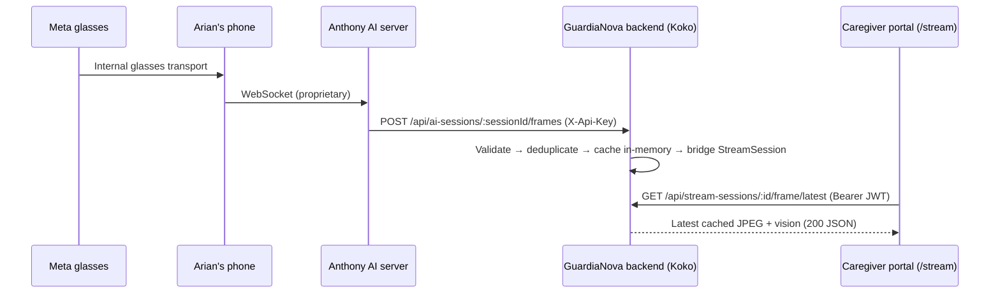

# Stream Status — Complete Integration Handoff

> **Audit date:** 2026-07-17
>
> **Codebase SHA:** current working tree
>
> **Auditor:** Antigravity (automated, code-verified)
>
> **Scope:** Egocentric glasses stream → caregiver portal, server callback pipeline, frontend `/stream` page

---

## 1  Executive summary

The egocentric stream pipeline relays per-frame JPEG snapshots and structured
vision metadata from Anthony's AI backend (via Meta smart-glasses → Arian's
mobile phone → Anthony server → GuardiaNova backend → caregiver portal).  The
caregiver's browser polls the backend for the latest cached frame and shows
it on the **`/stream`** route of the React SPA.

Key facts confirmed from source:

| Fact | Source file |
|---|---|
| Frontend route is `/stream` (not `/streams` or `/egocentric`) | [router.tsx](file:///c:/MemAide_github/client/src/app/router.tsx#L57) |
| JPEG base64 is **memory-only** (`Map<string, StoredFrame>`), never persisted to PostgreSQL | [latest-ai-frame.store.ts](file:///c:/MemAide_github/server/src/modules/ai-sessions/latest-ai-frame.store.ts#L44) |
| Vision fields, sequence, and timestamps **are** persisted in `StreamSession.metadata` (Prisma `Json?` column) | [stream.service.ts `toFrameMetadata`](file:///c:/MemAide_github/server/src/modules/streams/stream.service.ts#L120-L132) |
| Cache TTL cleanup is **lazy** (runs inside `acceptLatestFrame`, not a background timer) | [latest-ai-frame.store.ts `clearExpiredFrames` call](file:///c:/MemAide_github/server/src/modules/ai-sessions/latest-ai-frame.store.ts#L107) |
| Frame callback always returns `202` (accepted or duplicate/out-of-order) | [ai-session.controller.ts](file:///c:/MemAide_github/server/src/modules/ai-sessions/ai-session.controller.ts#L89-L105) |

---

## 2  Historical context: Anthony 422 root cause

Anthony's AI backend rejected the session-start payload with HTTP `422` when
any entry in the `patient.medications[]` array lacked a `name` field.
Medication items are synthesized from patient reminders in
[normalizeReminderMedications](file:///c:/MemAide_github/server/src/modules/ai-sessions/ai-session.service.ts#L234-L262).
The fix ensures every medication item has a non-empty `name` by falling back
through `reminder.description`, `reminder.type`, and finally the string
`"Medication reminder"`, with a defensive guard that filters any item where the
name is still falsy.

> [!NOTE]
> The `422` was **not** caused by missing vitals, an invalid session ID,
> malformed beacons, or an incorrect API key.  The specific root cause was
> `patient.medications[].name` being absent for reminders whose `description`
> and `type` were both empty or whitespace-only.

---

## 3  Architecture overview



### 3.1  Data persistence vs memory

| Data | Where stored | Lifetime |
|---|---|---|
| Raw JPEG base64 (`image.b64`) | **In-process `Map`** only | TTL 300 s (lazy), evicted at 50 sessions, cleared on session end |
| Vision description, label, flags, advisory_flags | `StreamSession.metadata` (PostgreSQL `Json?`) | Permanent (until row deleted) |
| Sequence number, capturedAt, receivedAt | `StreamSession.metadata` | Permanent |
| `aiSessionId` link | `StreamSession.metadata` | Permanent |

> [!IMPORTANT]
> The JPEG is **never** written to PostgreSQL, the file system, or any object
> store.  A server restart, process recycle, or TTL expiry permanently
> discards any uncollected frame image.  Vision metadata survives because it
> is written to the `StreamSession` row on every accepted frame via
> [upsertAiSessionFrameStream](file:///c:/MemAide_github/server/src/modules/streams/stream.service.ts#L259-L312).

### 3.2  Cache TTL cleanup strategy

Cache cleanup is **lazy, not timer-based**.  The function
[clearExpiredFrames](file:///c:/MemAide_github/server/src/modules/ai-sessions/latest-ai-frame.store.ts#L80-L89)
runs synchronously at the beginning of every `acceptLatestFrame` call (line 107).
There is no `setInterval`, cron, background worker, or event-loop timer that
proactively sweeps expired entries.  An entry whose TTL has elapsed may remain
in memory until the next inbound frame callback triggers the sweep.  The
`getLatestFrame` read path also checks `isExpired` and lazily deletes stale
entries on read (lines 143-146).

---

## 4  Complete endpoint contracts

### 4.1  Frame callback — Anthony → GuardiaNova

| Field | Value |
|---|---|
| **Method / Path** | `POST /api/ai-sessions/:sessionId/frames` |
| **Owner** | Anthony (caller) → Koko backend (receiver) |
| **Auth header** | `X-Api-Key: <AI_CALLBACK_API_KEY>` |
| **Content-Type** | `application/json` |
| **Body parser limit** | `1 MiB` (route-specific; app-wide limit is 10 KB) |
| **Idempotency** | Same `seq` returns `202 { accepted: false, reason: "duplicate" }` — safe to retry |
| **Lifecycle** | Only accepted while AiSession is non-terminal and associated StreamSession (if any) is non-terminal |

**Request body** (Zod schema: [aiSessionFrameCallbackSchema](file:///c:/MemAide_github/server/src/modules/ai-sessions/ai-session.schemas.ts#L162-L185)):

```jsonc
{
  "seq": 12,                                          // int ≥ 0, monotonic
  "ts": "2026-07-15T10:32:00.000000+00:00",           // ISO-8601, offset required
  "vision": {                                         // optional object (strict)
    "description": "An older adult seated…",          // string ≤ 2000 chars, nullable
    "label": "kitchen",                               // string ≤ 100 chars, nullable
    "flags": ["person_seated"],                       // string[] ≤ 50 items
    "advisory_flags": ["no_motion"]                   // string[] ≤ 50 items
  },
  "image": {                                          // optional object (strict)
    "mime": "image/jpeg",                             // literal "image/jpeg"
    "b64": "<raw-base64, no data-URL prefix>"         // decoded ≤ 768 KiB (786 432 bytes)
  }
}
// Super-refine: at least one of `image` or meaningful `vision` data must be present.
```

**Success response** — `202`:

```json
{ "success": true, "accepted": true, "sessionId": "…", "seq": 12, "receivedAt": "…" }
```

**Duplicate / out-of-order** — `202`:

```json
{ "success": true, "accepted": false, "reason": "duplicate", "sessionId": "…", "seq": 12 }
```

**Error responses:**

| Status | Condition | Code |
|---|---|---|
| `400` | Zod validation failure (missing image+vision, bad base64, oversized image, invalid ts) | `VALIDATION_ERROR` |
| `401` | Missing or wrong `X-Api-Key` | `INVALID_AI_CALLBACK_API_KEY` |
| `404` | `sessionId` not found in `ai_sessions` table | `NOT_FOUND` |
| `409` | AiSession is terminal (`resolved`, `cancelled`, `error`, `start_failed`) or has `endedAt` | `AI_SESSION_NOT_ACTIVE` |
| `409` | Associated StreamSession is terminal or has `endedAt` | `STREAM_SESSION_NOT_ACTIVE` |
| `413` | JSON body exceeds 1 MiB Express parser limit | — (Express default) |

---

### 4.2  Escalation callback — Anthony → GuardiaNova

| Field | Value |
|---|---|
| **Method / Path** | `POST /api/ai-sessions/:sessionId/escalation` |
| **Owner** | Anthony (caller) → Koko backend (receiver) |
| **Auth header** | `X-Api-Key: <AI_CALLBACK_API_KEY>` |
| **Content-Type** | `application/json` |
| **Body parser limit** | `10 KB` (app-wide) |
| **Idempotency** | If already `emergency_suggested`, returns `200 { success: true, alreadyEscalated: true }` |
| **Lifecycle** | Transitions AiSession to `emergency_suggested` via state machine |

**Request body** (Zod schema: [aiSessionEscalationCallbackSchema](file:///c:/MemAide_github/server/src/modules/ai-sessions/ai-session.schemas.ts#L187-L190)):

```json
{
  "reason": "Patient appears to have fallen and is not responding",
  "triggered_by": ["fall_detected", "no_response_30s"]
}
```

| Field | Type | Required | Notes |
|---|---|---|---|
| `reason` | `string` | Yes | Trimmed, min length 1 |
| `triggered_by` | `string[]` | No (defaults to `[]`) | Each item trimmed, min length 1 |

**Success response** — `200`:

```json
{ "success": true }
```

**Error responses:**

| Status | Condition |
|---|---|
| `400` | Zod validation or invalid state transition |
| `401` | Bad `X-Api-Key` |
| `404` | Session not found |
| `409` | AiSession is terminal or has `endedAt` |

---

### 4.3  Conclude callback — Anthony → GuardiaNova

| Field | Value |
|---|---|
| **Method / Path** | `POST /api/ai-sessions/:sessionId/conclude` |
| **Owner** | Anthony (caller) → Koko backend (receiver) |
| **Auth header** | `X-Api-Key: <AI_CALLBACK_API_KEY>` |
| **Content-Type** | `application/json` |
| **Body parser limit** | `10 KB` (app-wide) |
| **Idempotency** | If `aiConclusion` metadata already exists, returns `200 { success: true, alreadyConcluded: true }` and reconciles streams |
| **Lifecycle** | Transitions AiSession to `resolved` (or `error`), persists transcript messages, ends associated StreamSessions |

**Request body** (Zod schema: [aiSessionConcludeCallbackSchema](file:///c:/MemAide_github/server/src/modules/ai-sessions/ai-session.schemas.ts#L192-L212)):

```json
{
  "id": "anthony-internal-session-id",
  "patient_id": "guardianova-patient-uuid",
  "related_caretaker_id": "caretaker-uuid-or-null",
  "started_at": "2026-07-15T10:30:00+00:00",
  "ended_at": "2026-07-15T10:45:00+00:00",
  "handoff_at": "2026-07-15T10:40:00+00:00",
  "handoff_type": "caregiver_takeover",
  "transcript": [
    { "role": "agent", "text": "Hello, how can I help?", "ts": "2026-07-15T10:31:00+00:00", "scene_label": "kitchen" }
  ],
  "final_scene_label": "kitchen",
  "escalated": false,
  "status": "resolved",
  "outcome": "Patient confirmed they are fine after medication reminder.",
  "summary": "A concise 1–2 sentence caregiver summary based on the patient conversation."
}
```

| Field | Type | Required | Notes |
|---|---|---|---|
| `id` | `string` | Yes | Anthony's internal session identifier |
| `patient_id` | `string` | Yes | Must match `aiSession.patientId` or returns `400` |
| `related_caretaker_id` | `string?` | No | Nullable |
| `started_at` | ISO datetime | Yes | Offset required |
| `ended_at` | ISO datetime | Yes | Offset required |
| `handoff_at` | ISO datetime? | No | Nullable |
| `handoff_type` | `string?` | No | Nullable |
| `transcript` | array | Yes | `{ role, text, ts, scene_label? }` |
| `final_scene_label` | `string?` | No | Nullable |
| `escalated` | `boolean` | Yes | |
| `status` | `string` | Yes | Mapped: `"error"/"failed"` → `error`; else → `resolved` |
| `outcome` | `string` | Yes | |
| `summary` | `string?` | No | Nullable. Caregiver-facing summary of the conversation. Trimmed, 1–2000 chars (same cap as the caregiver resolve summary). Stored **verbatim** in `AiSession.summary` |

**Caregiver summary persistence:**

- When the **first** conclude callback carries a non-null `summary`, it is trimmed by the schema and stored verbatim in `AiSession.summary` — the caregiver portal shows this text on the session card and in the session detail panel.
- When `summary` is omitted or `null`, the backend keeps its generated fallback: `AI session concluded with outcome <outcome>. Final scene: <final_scene_label|unknown>.`
- Blank/whitespace-only → `400`; longer than 2000 characters → `400`. The session is left untouched in both cases.
- A **repeated** conclude callback never overwrites the summary already stored. Once `aiConclusion` metadata exists, the call only reconciles streams and returns `200 { success: true, alreadyConcluded: true }`. Send the summary with the first conclude; a later one is ignored.

**Error responses:**

| Status | Condition |
|---|---|
| `400` | Validation failure or `patient_id` mismatch |
| `401` | Bad `X-Api-Key` |
| `404` | Session not found |
| `409` | AiSession is terminal with no prior `aiConclusion` metadata |

---

### 4.4  Latest frame — Caregiver portal → GuardiaNova

| Field | Value |
|---|---|
| **Method / Path** | `GET /api/stream-sessions/:id/frame/latest` |
| **Owner** | Koko frontend (caller) → Koko backend (receiver) |
| **Auth header** | `Authorization: Bearer <JWT>` |
| **Body** | None (GET) |
| **Cache headers** | `Cache-Control: private, no-store, max-age=0` · `Pragma: no-cache` |
| **Idempotency** | GET, inherently idempotent |
| **Lifecycle** | Returns `available: false` for terminal, ended, expired, or mismatched states |

**Success response** — `200` (frame available):

```json
{
  "success": true,
  "data": {
    "available": true,
    "streamSessionId": "…",
    "aiSessionId": "…",
    "seq": 12,
    "capturedAt": "…",
    "receivedAt": "…",
    "image": { "mime": "image/jpeg", "b64": "…" },
    "vision": { "description": "…", "label": "…", "flags": [], "advisoryFlags": [] }
  }
}
```

**Success response** — `200` (frame unavailable):

```json
{
  "success": true,
  "data": {
    "available": false,
    "streamSessionId": "…",
    "aiSessionId": "…",
    "frameStatus": "waiting"
  }
}
```

`frameStatus` values: `"waiting"` · `"ended"` · `"failed"` · `"unavailable"`.

**Error responses:**

| Status | Condition |
|---|---|
| `401` | Missing or invalid JWT |
| `404` | StreamSession not found or caregiver does not own the patient |

---

### 4.5  Stream status — Caregiver portal → GuardiaNova

| Field | Value |
|---|---|
| **Method / Path** | `GET /api/patients/:patientId/stream-status` |
| **Owner** | Koko frontend (caller) → Koko backend (receiver) |
| **Auth header** | `Authorization: Bearer <JWT>` |
| **Idempotency** | GET |

**Success response** — `200`:

```json
{
  "success": true,
  "data": {
    "hasActiveStream": true,
    "displayStatus": "active",
    "viewerAvailable": false,
    "caregiverMessage": "Patient perspective stream is active, but no viewer URL is available yet.",
    "activeSession": {
      "id": "…", "status": "active", "source": "glasses", "viewerUrl": null,
      "startedAt": "…", "aiSessionId": "…", "frameAvailable": true,
      "lastFrameSeq": 12, "lastFrameAt": "…", "visionLabel": "kitchen",
      "visionDescription": "An older adult seated…"
    },
    "latestSession": { "id": "…", "status": "active", "source": "glasses", "startedAt": "…", "endedAt": null }
  }
}
```

---

### 4.6  Mobile stream endpoints

All mounted at `/api/mobile/stream/*` and require `Authorization: Bearer <JWT>`.

| Endpoint | Method | Schema | Response |
|---|---|---|---|
| `/api/mobile/stream/start` | POST | [startStreamSessionSchema](file:///c:/MemAide_github/server/src/modules/streams/stream.schemas.ts#L14-L22) | `201 { success, data }` |
| `/api/mobile/stream/stop` | POST | [stopStreamSessionSchema](file:///c:/MemAide_github/server/src/modules/streams/stream.schemas.ts#L24-L29) | `200 { success, data }` |
| `/api/mobile/stream/status` | POST | [updateStreamStatusSchema](file:///c:/MemAide_github/server/src/modules/streams/stream.schemas.ts#L31-L37) | `200 { success, data }` |

> [!WARNING]
> **Manual-stream duplicate risk:** Starting a manual `/api/mobile/stream/start`
> while an Anthony-originated glasses `StreamSession` already exists for the
> same patient **can** create a second `StreamSession` row **unless the caller
> explicitly links them through `metadata.aiSessionId`**.  Without that link the
> backend cannot detect the overlap because the glasses stream is keyed on
> `metadata.aiSessionId` via JSON path queries, not on a Prisma relation.

---

## 5  Configuration limitation: 768 KiB decoded image vs 1 MiB JSON body

> [!IMPORTANT]
> **Medium-severity configuration mismatch.**
>
> The Zod schema enforces a **768 KiB (786,432 bytes)** decoded-image ceiling
> (`AI_FRAME_MAX_DECODED_BYTES`), while the Express JSON body parser allows up to
> **1 MiB** (`AI_FRAME_JSON_LIMIT`).  Base64 encoding inflates data by ~33 %,
> so a 768 KiB decoded image becomes ~1,024 KiB of base64 text — nearly
> exhausting the 1 MiB body budget before accounting for the JSON envelope
> (`seq`, `ts`, `vision` fields, structural characters).
>
> In practice, a callback carrying a max-sized image **plus** large vision
> metadata may be silently rejected by the Express parser (`413`) before Zod
> validation even runs, producing a confusing error for the caller.
>
> **Recommendation:** Either reduce `AI_FRAME_MAX_DECODED_BYTES` to ~700 KiB,
> or increase `AI_FRAME_JSON_LIMIT` to `2mb` (and the NGINX
> `client_max_body_size` to match).  The NGINX location block in
> [EGOCENTRIC_STREAM_DEPLOYMENT.md](file:///c:/MemAide_github/docs/EGOCENTRIC_STREAM_DEPLOYMENT.md)
> must stay in sync.

---

## 6  StreamSession creation and first-callback behavior

The first **accepted** frame callback — including a vision-only callback that
carries no JPEG — triggers
[upsertAiSessionFrameStream](file:///c:/MemAide_github/server/src/modules/streams/stream.service.ts#L259-L312)
to create a new `StreamSession` row with `source: "glasses"` and
`status: "active"`.  Subsequent accepted frames update the existing row.

Whether an **image** actually appears in the caregiver viewer depends on whether
the callback included an `image` field:

- **Vision-only first callback:** StreamSession is created, metadata is
  populated, but `image` remains `null` in the cache.  The viewer shows a
  "waiting" state with no photograph.
- **First callback with JPEG:** StreamSession is created **and** the viewer can
  render the JPEG from the in-memory cache.

This distinction matters because Anthony may send a vision-only event (e.g.,
scene classification without a snapshot) before the first actual JPEG arrives.

---

## 7  Anthony Python integration example (corrected)

```python
"""
Corrected frame-callback client for Anthony's AI backend.

Status semantics:
  202         → accepted (whether truly new or duplicate/out-of-order)
  409         → session ended — STOP transmitting immediately
  4xx (other) → non-retryable client error — return failure
  5xx         → temporary server error — bounded retries
"""

import time
import requests

KOKO_URL = "https://caregiver.guardianova.com/api/ai-sessions"
API_KEY  = "replace-with-callback-key"
MAX_RETRIES = 3
BACKOFF_BASE = 1.0  # seconds


def send_frame(session_id: str, seq: int, ts: str,
               vision: dict | None = None,
               image: dict | None = None) -> str:
    """Returns 'ok', 'duplicate', 'stop', or 'fail'."""
    url = f"{KOKO_URL}/{session_id}/frames"
    headers = {"X-Api-Key": API_KEY, "Content-Type": "application/json"}
    body: dict = {"seq": seq, "ts": ts}
    if vision:
        body["vision"] = vision
    if image:
        body["image"] = image

    for attempt in range(MAX_RETRIES):
        try:
            resp = requests.post(url, json=body, headers=headers, timeout=5)
        except requests.RequestException:
            if attempt < MAX_RETRIES - 1:
                time.sleep(BACKOFF_BASE * (2 ** attempt))
                continue
            return "fail"

        if resp.status_code == 202:
            data = resp.json()
            if data.get("accepted"):
                return "ok"
            # duplicate or out_of_order — acknowledged, move on
            return "duplicate"

        if resp.status_code == 409:
            # Session or stream is terminal — stop transmitting
            return "stop"

        if 400 <= resp.status_code < 500:
            # Non-retryable client error (400, 401, 404, 413, etc.)
            return "fail"

        # 5xx — temporary server error, retry with backoff
        if attempt < MAX_RETRIES - 1:
            time.sleep(BACKOFF_BASE * (2 ** attempt))
            continue
        return "fail"

    return "fail"


# Usage example:
result = send_frame(
    session_id="clx123abc",
    seq=0,
    ts="2026-07-15T10:32:00.000000+00:00",
    vision={"description": "Patient in kitchen", "label": "kitchen",
            "flags": ["person_seated"], "advisory_flags": []},
    image={"mime": "image/jpeg", "b64": "<raw-base64>"},
)

if result == "stop":
    print("Session ended — stopping transmission")
elif result == "fail":
    print("Unrecoverable error — alert operator")
else:
    print(f"Frame sent: {result}")
```

---

## 8  Multiple backend processes: intermittent waiting / missing-frame behavior

> [!WARNING]
> The in-memory frame cache (`Map<string, StoredFrame>`) is **per-process**.
> If the backend runs multiple PM2 instances or cluster workers, each process
> holds a separate cache.  This causes **intermittent** behavior:
>
> - Anthony's frame callback hits process A, which stores the JPEG in its local
>   `Map`.
> - The caregiver's poll for `/frame/latest` is routed to process B, whose `Map`
>   has no entry for that session → returns `available: false, frameStatus:
>   "waiting"`.
>
> This manifests as **frames intermittently appearing and disappearing** in the
> viewer, not necessarily as a `404`.  The database `StreamSession.metadata`
> will still show `frameAvailable: true` from the accepted callback, but the
> binary JPEG data is only in the accepting process.
>
> **Current status:** The production deployment runs a single PM2 process, so
> this is not active.  Any future scale-out requires a shared cache layer
> (Redis, SQLite WAL, or object storage) to resolve this.

---

## 9  Testing status

### 9.1  Frontend tests

**Command:** `npx vitest run` in `client/`

| Metric | Value |
|---|---|
| Test files | **9 passed** (9 total) |
| Individual tests | **61 passed** (61 total) |
| Relevant stream test files | `EgocentricViewer.test.tsx` · `useStreamStatus.test.ts` · `useLatestStreamFrame.test.ts` · `apiClient.stream-frames.test.ts` |

These 61 tests were verified by running the actual `npx vitest run --reporter=verbose`
command on 2026-07-17 and inspecting the summary output.

### 9.2  Backend tests

16 test files exist under `server/src/__tests__/`, including:

- [ai-frames.test.ts](file:///c:/MemAide_github/server/src/__tests__/ai-frames.test.ts) — frame callback acceptance, deduplication, ordering, TTL, vision-only
- [ai-sessions.test.ts](file:///c:/MemAide_github/server/src/__tests__/ai-sessions.test.ts) — start, conclude, escalation, supersession, lifecycle
- [streams.test.ts](file:///c:/MemAide_github/server/src/__tests__/streams.test.ts) — stream session CRUD, bridge creation, status
- [mobile-egocentric-e2e.test.ts](file:///c:/MemAide_github/server/src/__tests__/mobile-egocentric-e2e.test.ts) — end-to-end mobile + egocentric flow

Backend tests require a PostgreSQL test database and are run separately with
`npx vitest run` from `server/`.

### 9.3  Live-device test status

> [!CAUTION]
> **Precise status of live testing:**
>
> 1. **Key-mismatch test (FAILED):** A live callback from Anthony's server
>    returned `401 INVALID_AI_CALLBACK_API_KEY` because the `AI_CALLBACK_API_KEY`
>    configured on the GuardiaNova backend did not match the `X-Api-Key` header
>    sent by Anthony's server.  This is a deployment configuration issue, not a
>    code bug — the middleware itself works correctly (timing-safe comparison).
>
> 2. **Manual vision-only 202 callback (SUCCEEDED):** A manually constructed
>    `POST /api/ai-sessions/:sessionId/frames` with a valid `X-Api-Key`, a
>    `seq`/`ts`, and vision-only data (no `image` field) was accepted and
>    returned `202 { accepted: true }`.  The StreamSession row was created with
>    correct metadata.
>
> No end-to-end live-device test (glasses → phone → Anthony → GuardiaNova →
> browser) has been completed.  The key-mismatch blocker must be resolved by
> coordinating the shared secret between Anthony's deployment and the
> GuardiaNova `.env`.

---

## 10  Team responsibilities

### 10.1  Arian (mobile / glasses integration)

Arian's phone app acts as the transport bridge between the Meta smart-glasses
and Anthony's AI server.  The phone establishes the proprietary WebSocket
connection to Anthony at `AI_AGENT_WS_URL`.

**What Arian needs from Koko's backend:**
- The session-start response provides `websocketUrl` and `helloMessage` (session ID) — see [startAiSession return](file:///c:/MemAide_github/server/src/modules/ai-sessions/ai-session.service.ts#L640-L648).
- Mobile stream CRUD via `/api/mobile/stream/*` for phone-originated streams (not glasses frames — those are Anthony callbacks).
- Mobile AI session lifecycle: `/api/mobile/ai-sessions/start`, `/:id/messages`, `/:id/resolve`, `/:id/emergency-suggestion-ack`.

**What Arian needs to verify:**
- `AI_AGENT_WS_URL` resolves and accepts the phone's WebSocket upgrade.
- The `deviceId` sent in `/api/mobile/ai-sessions/start` matches a registered patient's `deviceId` in the database.
- Glasses frames are being forwarded by Anthony (not by the phone directly to GuardiaNova).

### 10.2  Anthony (AI backend)

Anthony's server owns the AI conversation, vision processing, and frame
extraction from the glasses video feed.  It calls three GuardiaNova callback
endpoints (see §4.1–4.3):

| Callback | Purpose |
|---|---|
| `POST /:sessionId/frames` | Per-frame JPEG + vision → GuardiaNova cache |
| `POST /:sessionId/escalation` | Emergency escalation event |
| `POST /:sessionId/conclude` | Session end with transcript |

**What Anthony needs from Koko:**
- `AI_CALLBACK_API_KEY` shared secret (header: `X-Api-Key`).  This is a
  **different** key from `AI_AGENT_API_KEY`, which is used only for the outbound
  session-start request.
- `sessionId` from the session-start registration acknowledgment (sent via
  `AI_AGENT_URL`/session/start → response `{ status: "registered" }`).
- Compliance with the schema contracts in §4.1–4.3.

**Key integration notes:**
- Frame callbacks must include at least one of `image` or meaningful `vision` data.
- `image.b64` must be **raw** standard base64 (not URL-safe, not data-URL prefixed).
- `ts` requires an offset designator (`+00:00` or `Z`); naive timestamps are rejected.
- The backend returns `202` for all accepted, duplicate, and out-of-order frames.
- `409` means the session is terminal — Anthony should **stop** sending frames.

### 10.3  Koko (GuardiaNova backend + frontend)

Koko owns:
- All Express routes, Prisma schema, middleware, and business logic.
- The React caregiver portal at `/stream`.
- Frame cache lifecycle and StreamSession bridge.
- Environment variable management and NGINX proxy configuration.

**No known Koko code blockers** exist.  The callback pipeline, cache, bridge,
frontend polling, and viewer all function correctly in automated tests and
manual local testing.

> [!IMPORTANT]
> **Unresolved integration blocker:** The Anthony callback-key / live-JPEG
> integration has not been completed end-to-end.  The key-mismatch `401` from
> the live test (§9.3) must be resolved by synchronizing `AI_CALLBACK_API_KEY`
> between Anthony's deployment and GuardiaNova's `.env`.  Until this is done,
> no live glasses frames will flow through the pipeline.  This is a
> **deployment coordination issue**, not a Koko code defect.

---

## 11  Troubleshooting guide

### 11.1  Common failure modes

| Symptom | Likely cause | Action |
|---|---|---|
| `401` on frame callback | `AI_CALLBACK_API_KEY` mismatch | Compare Anthony's `X-Api-Key` value with `server/.env` `AI_CALLBACK_API_KEY` |
| `404` on frame callback | Wrong `sessionId` or session never created | Verify session-start returned `{ status: "registered" }` and the `session.id` matches |
| `400` on frame callback | Schema validation failure | Check: `ts` has offset, `b64` is raw base64, at least one of `image`/`vision` present |
| `409` on frame callback | Session or stream is terminal | Session was resolved/cancelled/errored — start a new session |
| `413` on frame callback | Body exceeds 1 MiB | Reduce image quality or see §5 for limit mismatch |
| `422` on session start | Anthony rejected the payload | Check `patient.medications[].name` is populated (see §2) |
| `502`/`504` on session start | Anthony server unreachable or timed out | Check `AI_AGENT_URL`, network, Anthony server status |
| Viewer shows "waiting" indefinitely | Cache empty — no accepted frame yet | Confirm Anthony is sending frames; check for `401`/`409` in server logs |
| Frames appear intermittently | Multiple backend processes (see §8) | Ensure single PM2 process or add shared cache |
| Frame image disappears after ~5 min | Cache TTL expiry (lazy cleanup) | Normal behavior if no new frames arrive; Anthony must keep sending |

### 11.2  Safe diagnostic commands

```bash
# Check server health
curl -s http://localhost:4000/api/health | jq

# Check NGINX configuration for frame route
sudo nginx -T | grep -B 4 -A 12 "frames"

# Check PM2 process count (should be 1 for single-process cache)
pm2 list

# View recent server logs for callback errors
pm2 logs --lines 50 | grep -i "ai-session\|frame\|callback"

# Test callback authentication (dry run)
curl -s -o /dev/null -w "%{http_code}" \
  -X POST "http://localhost:4000/api/ai-sessions/test-id/frames" \
  -H "X-Api-Key: $(grep AI_CALLBACK_API_KEY server/.env | cut -d= -f2)" \
  -H "Content-Type: application/json" \
  -d '{"seq":0,"ts":"2026-01-01T00:00:00+00:00","vision":{"description":"test","label":"test","flags":[],"advisory_flags":[]}}'

# List active stream sessions in database
npx prisma studio
# Or via psql:
# SELECT id, status, source, metadata->>'aiSessionId' FROM stream_sessions WHERE status IN ('starting','active') ORDER BY "createdAt" DESC LIMIT 10;
```

---

## 12  Environment variables

All stream-related environment variables are defined in
[env.ts](file:///c:/MemAide_github/server/src/config/env.ts) and documented in
[.env.example](file:///c:/MemAide_github/server/.env.example):

| Variable | Default | Purpose |
|---|---|---|
| `AI_AGENT_URL` | — (required) | Anthony's session-start REST endpoint base URL |
| `AI_AGENT_WS_URL` | — (required) | WebSocket URL returned to mobile for phone→Anthony |
| `AI_AGENT_API_KEY` | — (required) | **Outbound** key for `POST /session/start` to Anthony |
| `AI_AGENT_API` | — (legacy alias) | Falls back if `AI_AGENT_API_KEY` is unset |
| `AI_AGENT_TIMEOUT_MS` | `5000` | Timeout for session-start HTTP call |
| `AI_CALLBACK_API_KEY` | — (required in prod) | **Inbound** key Anthony sends as `X-Api-Key` on callbacks |
| `AI_FRAME_JSON_LIMIT` | `1mb` | Express JSON parser limit for frame route only |
| `AI_FRAME_MAX_DECODED_BYTES` | `786432` (768 KiB) | Max decoded JPEG size in Zod validation |
| `AI_FRAME_CACHE_TTL_SECONDS` | `300` | In-memory frame cache entry TTL |
| `AI_FRAME_CACHE_MAX_SESSIONS` | `50` | Max concurrent sessions in frame cache |
| `AI_SESSION_STALE_MINUTES` | `15` | Staleness window for joinability computation |

> [!CAUTION]
> `AI_AGENT_API_KEY` (outbound to Anthony) and `AI_CALLBACK_API_KEY` (inbound
> from Anthony) are **different secrets** with different purposes.  Using one
> where the other is expected produces a `401`.

---

## 13  Defect audit summary

| # | Severity | Component | Description | Status |
|---|---|---|---|---|
| 1 | **High** | Deployment | `AI_CALLBACK_API_KEY` mismatch between Anthony and GuardiaNova `.env` | **Open** — coordination required |
| 2 | **Medium** | Config | 768 KiB decoded-image limit + 33% base64 overhead nearly exhausts 1 MiB JSON body limit (§5) | **Open** — recommend adjusting limits |
| 3 | **Medium** | Scalability | In-memory frame cache is per-process; multi-instance PM2 causes intermittent frame loss (§8) | **Open** — acceptable for single-process MVP |
| 4 | **Low** | Schema | `vision.advisory_flags` are persisted in StreamSession metadata but never surfaced in UI | By design — future feature |
| 5 | **Low** | UX | No explicit "stream ended" push notification; frontend discovers state via polling | By design — WebSocket is a future enhancement |

**No Koko code defects** were found in the stream pipeline, cache, bridge, or
frontend implementation.  All automated tests pass.  The only integration
blocker is the deployment key mismatch (#1), which requires Anthony to confirm
and synchronize the shared `AI_CALLBACK_API_KEY` value.

---

## 14  Files referenced in this document

| File | Role |
|---|---|
| [stream.service.ts](file:///c:/MemAide_github/server/src/modules/streams/stream.service.ts) | Stream CRUD, frame bridge, status queries |
| [stream.schemas.ts](file:///c:/MemAide_github/server/src/modules/streams/stream.schemas.ts) | Mobile stream Zod schemas |
| [stream.controller.ts](file:///c:/MemAide_github/server/src/modules/streams/stream.controller.ts) | Stream HTTP handlers |
| [stream.routes.ts](file:///c:/MemAide_github/server/src/modules/streams/stream.routes.ts) | Caregiver stream route mounting |
| [ai-session.service.ts](file:///c:/MemAide_github/server/src/modules/ai-sessions/ai-session.service.ts) | AI session lifecycle, frame recording, conclude/escalation |
| [ai-session.schemas.ts](file:///c:/MemAide_github/server/src/modules/ai-sessions/ai-session.schemas.ts) | Frame, escalation, conclude Zod schemas |
| [ai-session.controller.ts](file:///c:/MemAide_github/server/src/modules/ai-sessions/ai-session.controller.ts) | Callback HTTP handlers (202 response) |
| [ai-frame.routes.ts](file:///c:/MemAide_github/server/src/modules/ai-sessions/ai-frame.routes.ts) | Frame callback route with 1 MiB parser |
| [ai-session.routes.ts](file:///c:/MemAide_github/server/src/modules/ai-sessions/ai-session.routes.ts) | Escalation + conclude routes |
| [latest-ai-frame.store.ts](file:///c:/MemAide_github/server/src/modules/ai-sessions/latest-ai-frame.store.ts) | In-memory frame cache (Map) |
| [ai-session.lifecycle.ts](file:///c:/MemAide_github/server/src/modules/ai-sessions/ai-session.lifecycle.ts) | Joinability, terminal/stale logic |
| [ai-callback-auth.middleware.ts](file:///c:/MemAide_github/server/src/middleware/ai-callback-auth.middleware.ts) | Timing-safe API key validation |
| [app.ts](file:///c:/MemAide_github/server/src/app.ts) | Route mounting, body parser order |
| [env.ts](file:///c:/MemAide_github/server/src/config/env.ts) | Environment schema and defaults |
| [schema.prisma](file:///c:/MemAide_github/server/prisma/schema.prisma) | Database models (StreamSession, AiSession) |
| [router.tsx](file:///c:/MemAide_github/client/src/app/router.tsx) | Frontend route: `/stream` |
| [StreamStatusPage.tsx](file:///c:/MemAide_github/client/src/features/stream/StreamStatusPage.tsx) | Stream viewer page component |
