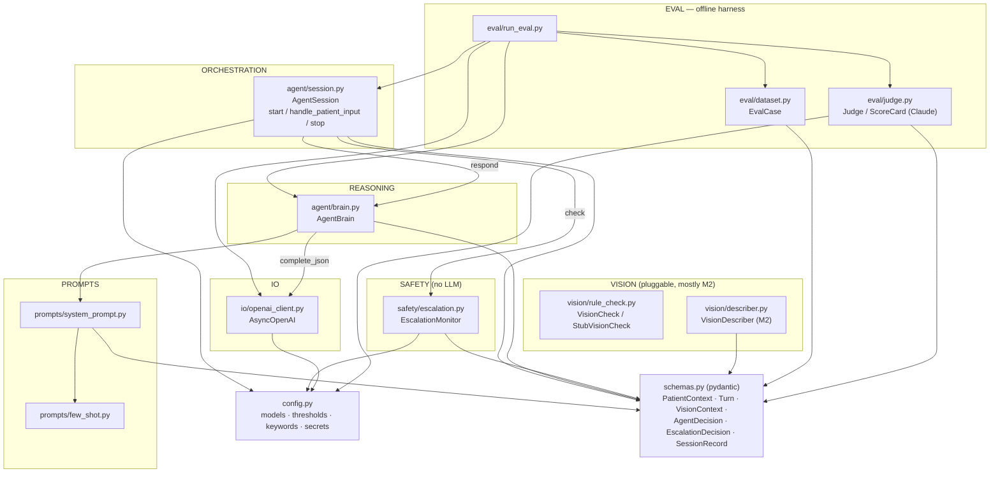
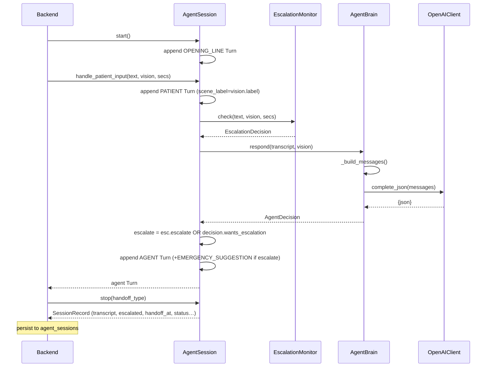

# MemAide Agent Foundation — Architecture

The text-driven "brain" of an assistive voice agent for elderly patients. A patient
presses a Help button → an `AgentSession` runs the conversation, leaning on an LLM brain
for replies and a separate **rule-based** safety monitor for emergencies, then emits a
`SessionRecord` the backend persists. Live audio/vision is deliberately stubbed
(Milestone 2).

## Layered structure

Everything points **down** to `schemas.py` — the pydantic models are the shared currency
and the backend integration surface.



## The two-track decision (the key design idea)

Each patient turn runs **two independent judgments** that are OR'd together, so safety
never depends on the LLM behaving.

```mermaid
flowchart TD
    IN["handle_patient_input(text, vision, seconds_since_last_speech)"]
    IN --> ESC["EscalationMonitor.check()<br/><i>deterministic rules</i><br/>• distress keyword in text?<br/>• critical vision flag?<br/>• silence + abnormal vision?"]
    IN --> BRAIN["AgentBrain.respond()<br/><i>gpt-4o-mini</i><br/>• system prompt + patient block + few-shot<br/>• full transcript replayed<br/>• + [VISION CONTEXT] line"]
    ESC --> ED["EscalationDecision.escalate"]
    BRAIN --> AD["AgentDecision.wants_escalation"]
    ED --> OR{"escalate =<br/>rule OR model"}
    AD --> OR
    OR -->|true| ADD["reply += EMERGENCY_SUGGESTION<br/>(\"…call 911…\")"]
    OR -->|false| KEEP["reply unchanged"]
    ADD --> APP["append agent Turn → transcript"]
    KEEP --> APP
```

## One full turn (sequence)



## Module-by-module

| Module | Role | Depends on |
|---|---|---|
| `schemas.py` | Pydantic data contracts; shared with backend | — (foundation) |
| `config.py` | Model names, escalation thresholds/keywords, `.env` secrets | dotenv |
| `prompts/few_shot.py` | 5 labeled example exchanges, rendered as JSON | — |
| `prompts/system_prompt.py` | Assembles base + patient block + few-shot | few_shot, schemas |
| `io/openai_client.py` | Async `complete_json()` over `AsyncOpenAI` | config |
| `agent/brain.py` | Maps transcript→messages, injects vision, validates `AgentDecision` | prompts, schemas |
| `agent/session.py` | Turn loop, two-track escalation, `SessionRecord` | config, safety, schemas |
| `safety/escalation.py` | Deterministic emergency detection | config, schemas |
| `vision/rule_check.py` | `VisionCheck` protocol + `StubVisionCheck` | — |
| `vision/describer.py` | M2 frame→`VisionContext` (NotImplemented) | schemas |
| `eval/dataset.py` | `EvalCase` fixtures (5 scenarios) | schemas |
| `eval/judge.py` | Claude Opus `ScoreCard` judge (optional) | config, dataset, schemas |
| `eval/run_eval.py` | Runs cases through the agent, exports MD/JSON | brain, session, io, dataset, judge |

## Design notes

- **Duck typing at the seams.** `AgentSession.brain` and `AgentBrain.client` are typed
  `Any` — the brain only needs `respond(...)` and the client only needs
  `complete_json(...)`. This makes the whole system testable without network calls and
  lets eval swap in fakes.
- **Two LLM vendors, cleanly separated.** OpenAI (gpt-4o-mini) runs the agent;
  Anthropic (claude-opus-4-8) appears only in the eval *judge* — the runtime path never
  touches it.
- **Vision is a hollow seam.** `VisionContext` flows through `session → brain` and
  `→ escalation` today, but it's produced by `StubVisionCheck` / hand-written fixtures.
  `VisionDescriber` is the M2 fill-in, and the interface is already frozen.
